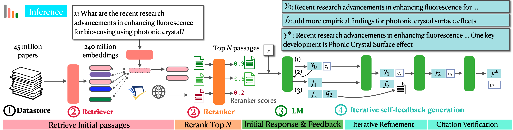

# OpenScholar 

This repository contains the code bases of OpenScholar. 

[**Blog**](https://allenai.org/blog/openscholar) | [**Demo**](https://open-scholar.allen.ai/) |
[**Paper**](https://arxiv.org/abs/2411.14199) | [**Model checkpoints and data**](https://huggingface.co/collections/OpenScholar/openscholar-v1-67376a89f6a80f448da411a6) | [**ScholarQABench**](https://github.com/AkariAsai/ScholarQABench/) | [**Expert Evaluation**](https://github.com/AkariAsai/OpenScholar_ExpertEval) | 
[**Slides**](https://akariasai.github.io/assets/pdf/open_scholar_slides.pdf) 
 
### Table of contents
1. [Overview of OpenScholar](#overview-of-openscholar)
2. [Repository Organizations](#repository-organizations)
3. [Installation](#installation)
4. [Run OpenScholar](#run-openscholar-inference)
5. [Train OpenScholar-8B](#training)
6. [Run Retriever](#run-retriever)
6. [Contact and Citation](#contact-and-citation)


## Overview of OpenScholar
Scientific progress hinges on our ability to find, synthesize, and build on relevant knowledge from the scientific literature. However, the exponential growth of this literature—with millions of papers now published each year—has made it increasingly difficult for scientists to find the information they need or even stay abreast of the latest findings in a single subfield.

To help scientists effectively navigate and synthesize scientific literature, we introduce **OpenScholar**, a retrieval-augmented language model (LM) designed to answer user queries by first searching for relevant papers in the literature and then generating responses grounded in those sources. Try [open-scholar.allen.ai/](https://open-scholar.allen.ai/) and check [our paper](https://openscholar.allen.ai/paper) for more detail.





## Repository Organizations
This repository contains codes to run OpenScholar inference. 

- [`src/`](src): Main source codes for OpenScholar. 
- [`training/`](training): Our training code to train Llama 3.1 8B using our processed data. We modified earlier version of `torchtune` for training. 
- [`retriever/`](retriever): Code base to run retrieval offline & host retrieval servers for online retrieval.  

For automatic and human evaluations, please check the following repositories. 
- To run evaluations on **ScholarQABench**, please check the [ScholarQABench](https://github.com/AkariAsai/ScholarQABench/) repository. 
- For our human evaluation interfaces as well as the results, please check the [OpenScholar_ExpertEval](https://github.com/AkariAsai/OpenScholar_ExpertEval) repository. 

## Installation 
To run OpenScholar inference, please ensure that all necessary libraries are installed. 

[test environment command]

```python
conda create -n os_env python=3.10.0
conda activate os_env
pip install -r requirements.txt
python -m spacy download en_core_web_sm
``` 

Also please set the following API keys:

```sh
export S2_API_KEY=YOUR_S2_API_KEY
```
See instructions to acquire API keys at [Semantic Scholar API Page](https://www.semanticscholar.org/product/api). 

If you want to also want to use web search engine, then sign up for you.com web API and set the key.
```sh
export YOUR_API_KEY=YOUR_YOU_COM_API_KEY
```

For information related to OpenScholar training and retriever components, refer to the [`training/`](training/) and [`retrieval/`](retrieval) directories, respectively.

## Run OpenScholar inference

By default, OpenScholar takes retrieval results from off-line retrieval results after running the retrieval scripts in [retrieval/](retireval), followed by additional retrieval from Semantic Scholar Paper API and web search API results. See the script [src/use_search_apis.py](src/use_search_apis.py) to retrieve related passages offline using external APIs. 

We released our retrieval results at [google drive](https://drive.google.com/drive/folders/1lOloYPOveKesD-37lD4Dlju96tc0XIm9?usp=sharing).  

### Use Open LMs (e.g., `Llama-3.1_OpenScholar-8B`) locally 
- Run a Standard RAG pipeline using top 10 

```sh
python run.py \
    --input_file YOUR_INPUT_FILE \
    --model_name OpenScholar/Llama-3.1_OpenScholar-8B \
    --use_contexts \
    --output_file OUTPUT_FILE_PATH \
    --top_n 10 --llama3 --zero_shot
```

- Run a Retriever+ Reranker Pipeline

```sh
python run.py \
    --input_file YOUR_INPUT_FILE \
    --model_name OpenScholar/Llama-3.1_OpenScholar-8B \
    --use_contexts \
    --ranking_ce \
    --reranker OpenScholar/OpenScholar_Reranker \
    --output_file OUTPUT_FILE_PATH \
    --top_n 10 --llama3 --zero_shot
```

- Run Open Retriever Self-reflective Generation pipeline


```sh
python run.py \
    --input_file YOUR_INPUT_FILE \
    --model_name  OpenScholar/Llama-3.1_OpenScholar-8B \
    --use_contexts --output_file OUTPUT_FILE_NAME \
    --top_n 10 --llama3 --use_contexts \
    --ranking_ce --reranker OpenScholar/OpenScholar_Reranker \ 
    --posthoc --feedack --ss_retriever \
    --use_abstract --norm_cite --zero_shot --max_per_paper 3 \
```


#### Use propriety LMs e.g., OpenAI GPT4o 

You can also combine the OpenScholar pipeline with propriety LLMs, by specifying  `model_name`, `api` and `api_key_fp`. 

```sh
python run.py \
    --input_file YOUR_INPUT_FILE \
    --model_name "gpt-4o" \
    --api "openai" \
    --api_key_fp PATH_TO_YOUR_OPEN_AI_KEY \ 
    --use_contexts \
    --output_file OUTPUT_FILE_PATH \
    --top_n 10 --llama3 --zero_shot
```

## Details of configurations 
Below, we provide the detailed of configurations. 

- `top_n`: The number of passages to be fed into the underlying LM. By default, we use `10` for multi-paper tasks. 
- `feedback`: Set true if you want to use the self-feedback loop during generation.
- `posthoc_at`: Set true if you want to run posthoc citation attributions 
- `zero_shot`: Set true if you want to run inference in a zero-shot manner. 
- `ranking_ce`: Use a reranking model to rerank `top_n` passages; If not set true, we take the `top_n` passages from the `ctxs` in the provided input file. 
- `reranker`: Specify the path to the reranker model file (local or HF hub). If you use our OpenScholar reranker, set `OpenScholar/OpenScholar_Reranker`
- `min_citation`: You can set the minimum number of citations. If any `int` is given, we exclude papers whose citations is below `min_citation`. By default, we set it to `None` and all papers are considered regardless of their citation counts. 
- `ss_retriever`: Use semantic scholar API during the feedback generation loop to enhance the feedback results. 
- `use_abstract`: Consider abstract to enhance the reranking results. 
- `max_per_paper`: set the maximum number of passages from the same paper used during inference time. 
- `task_name`: specify the task names when you run the single paper tasks. For SciFact, PubmedQA and QASA, the corresponding task names are `claim_full`, `boolean_question_full` and `single_qa`, respectively. 

## Training
We train our [OpenScholar-8B](https://huggingface.co/OpenScholar/OpenScholar_Llama-3.1-8B) using our [OpenScholar/OS_Train_Data]([https://huggingface.co/OpenScholar/OpenScholar_Train_Data](https://huggingface.co/datasets/OpenScholar/OS_Train_Data)) data, which consists of 13k instruction-tuning data. We use our modified version of [torchtune]() to train our 8B model using 8*A100. 

See mode detailed instructions for setting up the training in [train/](train)

## Run Retriever
Both our peS2o v2 and v3 datastore (chunked text + index) are available: 
- [OpenScholar/OpenScholar-DataStore-V2](https://huggingface.co/OpenScholar/OpenScholar-DataStore-V2)
- [OpenScholar/OpenScholar-DataStore-V3](https://huggingface.co/OpenScholar/OpenScholar-DataStore-V3)

See instructions under [retriever](retriever) to run the peS2o index locally. Note that due to the massive-scale of index (200+M embeddings based on 45 million papers), the peS2o retriever requires a lot of CPU memory. In our main experiments, we retrieved initial passages offline. 

**We are planning to release our efficient sparse-dense retriever API endpoint used for the OpenScholar Demo publicly via Semantic Scholar API to accelerate research for LLMs for scientific literature synthesis. Stay tune!!d!**


## Contact and Citation
If you have any questions, please contact `akari@cs.washington`. Note that I am currently applying for academic jobs so I may be slow to respond. 
If you have any questions related to demo, please file your request from [google form](https://docs.google.com/forms/d/e/1FAIpQLSfqPUKxxXlV16Bs8ZGcasXMP35WKQU6eeQhYViPQ9_Cmeq5Kw/viewform).

```
@article{openscholar,
  title={{OpenScholar}: Synthesizing Scientific Literature with Retrieval-Augmented Language Models},
  author={Asai, Akari and He*, Jacqueline and Shao*, Rulin and Shi, Weijia and Singh, Amanpreet and Chang, Joseph Chee  and Lo,  Kyle and Soldaini, Luca and Feldman, Tian, Sergey and Mike, D’arcy and Wadden, David and Latzke, Matt and Minyang and Ji, Pan and Liu, Shengyan and Tong, Hao and Wu, Bohao and Xiong, Yanyu and Zettlemoyer, Luke and Weld, Dan and Neubig, Graham and Downey, Doug and Yih, Wen-tau and Koh, Pang Wei and Hajishirzi, Hannaneh},
  journal={Arxiv},
  year={2024},
}
```
